<!--
  NOTE FOR MAINTAINER: the original README used two different GitHub owners
  (aditisaha1089 and i-Anurag1) and two different live URLs
  (fintoranai.streamlit.app and fintoranagent.streamlit.app).
  Both sets are preserved below. Please verify and keep only the correct ones.
-->

<div align="center">


<br/>

**Turn raw financial data into structured intelligence, explanations, forecasts, anomaly signals and actionable insights.**

<br/>

[](https://www.python.org/)
[](https://streamlit.io/)
[](https://langchain-ai.github.io/langgraph/)
[](https://www.langchain.com/)
[](https://groq.com/)

[](https://www.sqlite.org/)
[](https://www.trychroma.com/)
[](https://www.docker.com/)
[](https://pytest.org/)
[](https://github.com/features/actions)

<br/>

[](https://fintoranagent.streamlit.app/)
[](https://github.com/i-Anurag1/Fintoran)

<br/>

<a href="#-vision">Vision</a> &nbsp;·&nbsp;
<a href="#-capabilities">Capabilities</a> &nbsp;·&nbsp;
<a href="#-architecture">Architecture</a> &nbsp;·&nbsp;
<a href="#-agentic-design">Agents</a> &nbsp;·&nbsp;
<a href="#-data-pipeline">Pipeline</a> &nbsp;·&nbsp;
<a href="#-security">Security</a> &nbsp;·&nbsp;
<a href="#-quick-start">Quick Start</a> &nbsp;·&nbsp;
<a href="#-roadmap">Roadmap</a>

</div>

<br/>

```text
███████╗██╗███╗   ██╗████████╗ ██████╗ ██████╗  █████╗ ███╗   ██╗
██╔════╝██║████╗  ██║╚══██╔══╝██╔═══██╗██╔══██╗██╔══██╗████╗  ██║
█████╗  ██║██╔██╗ ██║   ██║   ██║   ██║██████╔╝███████║██╔██╗ ██║
██╔══╝  ██║██║╚██╗██║   ██║   ██║   ██║██╔══██╗██╔══██║██║╚██╗██║
██║     ██║██║ ╚████║   ██║   ╚██████╔╝██║  ██║██║  ██║██║ ╚████║
╚═╝     ╚═╝╚═╝  ╚═══╝   ╚═╝    ╚═════╝ ╚═╝  ╚═╝╚═╝  ╚═╝╚═╝  ╚═══╝
```

> **Fintoran** is an agentic AI financial intelligence workspace that transforms personal financial data into structured, explainable and actionable insights.

<br/>

## ✦ At a Glance

<div align="center">

| 🧩 **10** | 🤖 **4** | 🌐 **3** | ✅ **49** | 🐍 **2** |
|:---:|:---:|:---:|:---:|:---:|
| Product modules | Specialist agents | External data providers | Passing tests | Python versions in CI |

</div>

<br/>

## ✦ Vision

Fintoran is **not** a generic chatbot placed on top of a spreadsheet. It is a financial intelligence layer built on one central rule:

> **Numbers come from deterministic code. Language comes from the LLM.**

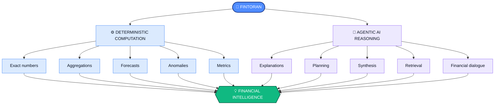

<br/>

## ✦ Capabilities

<div align="center">

| | Module | What it does |
|:---:|:---|:---|
| 📊 | **Overview** | Financial health summary and key metrics |
| 🤖 | **AI Copilot** | Agentic financial conversations |
| 💳 | **Transactions** | Search, filtering, categorization and transaction intelligence |
| 📈 | **Analytics** | Spending, income, category and trend analysis |
| 🎯 | **Budgets** | Budget tracking and financial planning |
| 💡 | **Insights** | Automated financial observations |
| 🌍 | **Market Research** | Market, macroeconomic and company research |
| 📄 | **Documents / RAG** | Grounded answers from uploaded financial documents |
| 🧠 | **Memory** | Persistent conversation context |
| ⚙️ | **Settings** | Account and application configuration |

</div>

<br/>

## ✦ Architecture

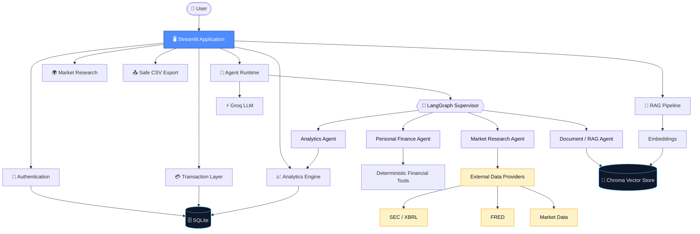

<br/>

## ✦ Agentic Design

Fintoran uses a **supervisor-driven architecture** instead of routing every request straight to a single LLM.

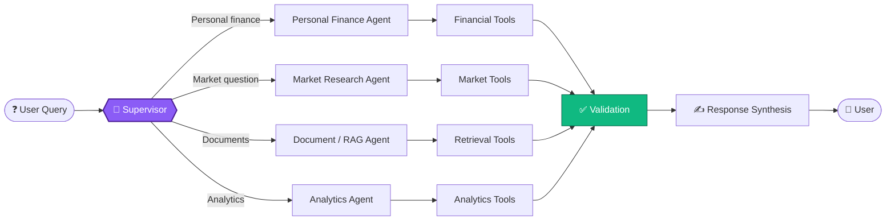

### Life of a Query

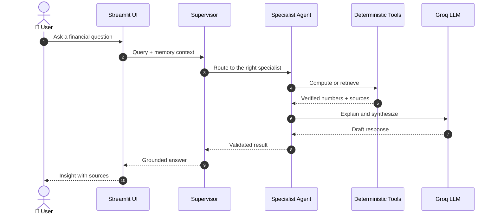

### Separation of Concerns

| Layer | Responsibility | Owner |
|:---|:---|:---|
| **Computation** | Exact arithmetic, aggregation, forecasting | Deterministic Python |
| **Reasoning** | Explanation, planning, synthesis | LLM agents |
| **Retrieval** | Document and memory grounding | Chroma + retrievers |
| **Presentation** | Rendering, sources, safe output | Streamlit |

<br/>

## ✦ Data Pipeline

Imported data flows through a **validated pipeline**. Raw CSV rows are never inserted directly.

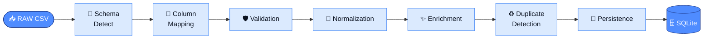

<div align="center">

| Ingestion | Processing | Delivery |
|:---|:---|:---|
| Schema detection | Date parsing | Preview before import |
| Column mapping | Debit / credit handling | Import summaries |
| Malformed row handling | Currency normalization | Provenance tracking |
| Duplicate detection | Categorization and merchants | Safe export |
| | Recurring transactions | |

</div>

<br/>

## ✦ Analytics Engine

The analytics layer is **intentionally deterministic**. The LLM never performs core financial arithmetic.

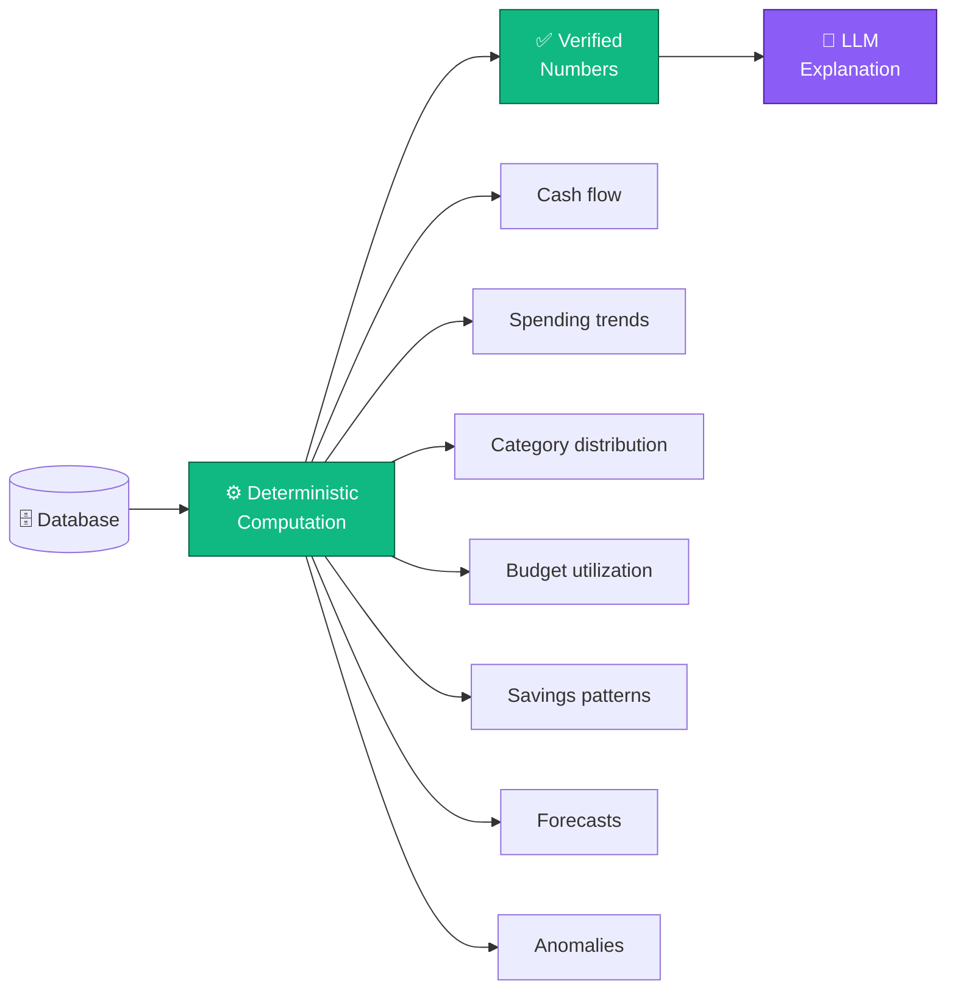

<br/>

## ✦ Forecasting

Forecasts use deterministic methods and are shown with uncertainty **only when the data supports it**.

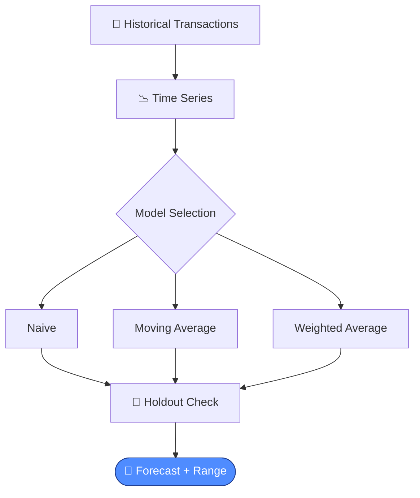

<br/>

## ✦ Anomaly Detection

Fintoran analyzes **multiple dimensions** rather than flagging every unusual amount.

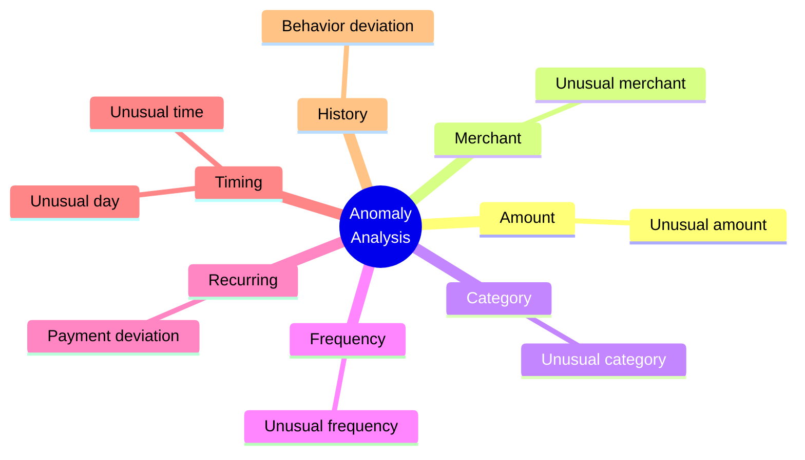

<br/>

## ✦ RAG and Memory

Conversation memory and document retrieval are **separate systems** that solve different problems.

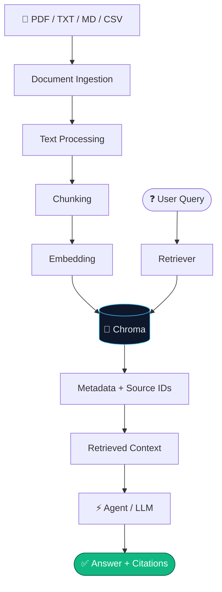

<div align="center">

| | 🧠 Conversation Memory | 📄 Document RAG |
|:---|:---|:---|
| **Answers** | *"What did we discuss?"* | *"What does my document say?"* |
| **Source** | User dialogue | User documents |
| **Purpose** | Context recall | Grounded retrieval |
| **Storage** | Memory layer (Chroma) | Document layer (Chroma) |

</div>

**Retrieval supports:** ingestion · chunking · embeddings · metadata · source identifiers · retrieval scores · document isolation · reindexing · duplicate handling · deletion · source-aware responses

<br/>

## ✦ Market Research

The research layer is built around **external data provenance**.

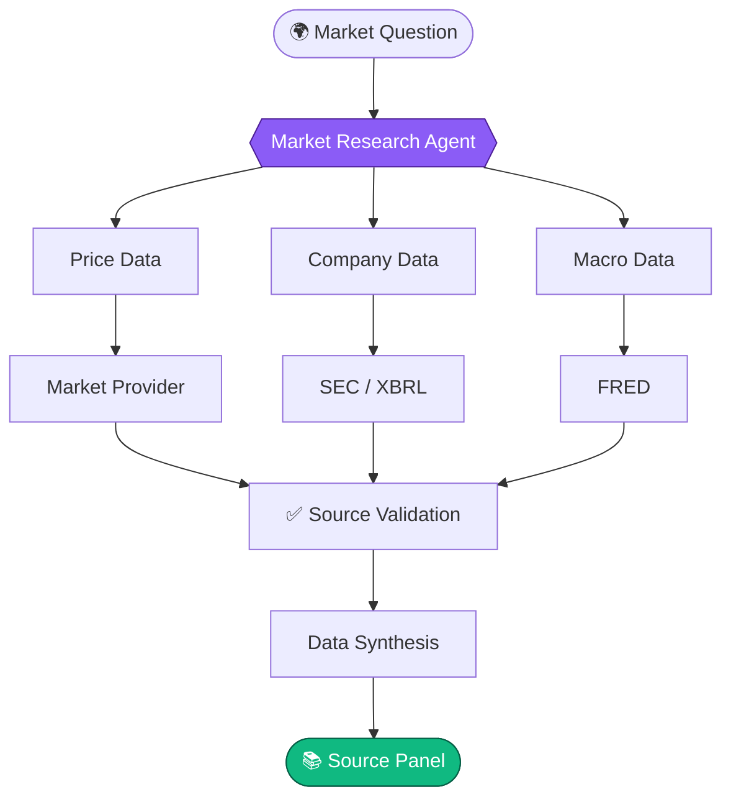

<div align="center">

| Market | Fundamentals | Macro and Provenance |
|:---|:---|:---|
| Quotes | Company fundamentals | Macroeconomic indicators |
| Historical prices | SEC filings | Source provenance |
| Returns | Earnings information | |
| Volatility | | |
| Drawdowns | | |
| Moving averages and volume | | |

</div>

<br/>

## ✦ Security

Fintoran treats financial data as **private application data**.

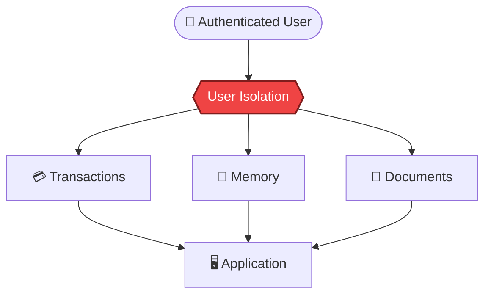

<div align="center">

| 🔑 Identity | 🧱 Data | 📁 Files | 🤖 AI |
|:---|:---|:---|:---|
| bcrypt authentication | Account-level isolation | Upload validation | Prompt injection defenses |
| Environment-based secrets | Input validation | Upload limits | Private document isolation |
| No API keys in source | Safe rendering | Path traversal protection | Controlled logging |

</div>

### Safe CSV Export

Values that begin with spreadsheet formula prefixes are neutralized so spreadsheet apps never execute them.

| Raw value | Exported as |
|:---|:---|
| `=SUM(A1:A2)` | `'=SUM(A1:A2)` |
| `+100` | `'+100` |
| `-100` | `'-100` |
| `@command` | `'@command` |

<br/>

## ✦ Reliability

Agent execution is **failure-aware**. Provider failures never break core deterministic functionality.

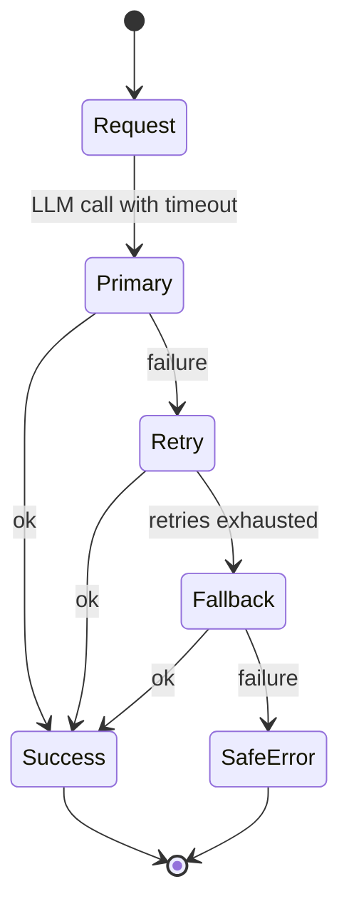

<br/>

## ✦ Testing and CI/CD

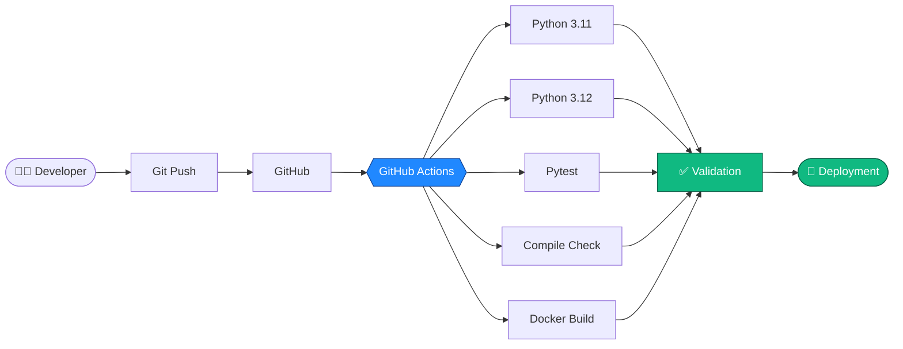

<div align="center">

| 🧪 Unit | 🔗 Integration | 🛡️ Security |
|:---:|:---:|:---:|
| Application behavior | Financial processing | Security-sensitive paths |
| Regression cases | Import behavior | Upload and export safety |


</div>

<br/>

## ✦ Docker


Designed for **deterministic startup** · **non-root execution** · **health checks** · **application isolation** · **runtime environment variables** · **reproducible dependency installation**

<br/>

## ✦ User Journey

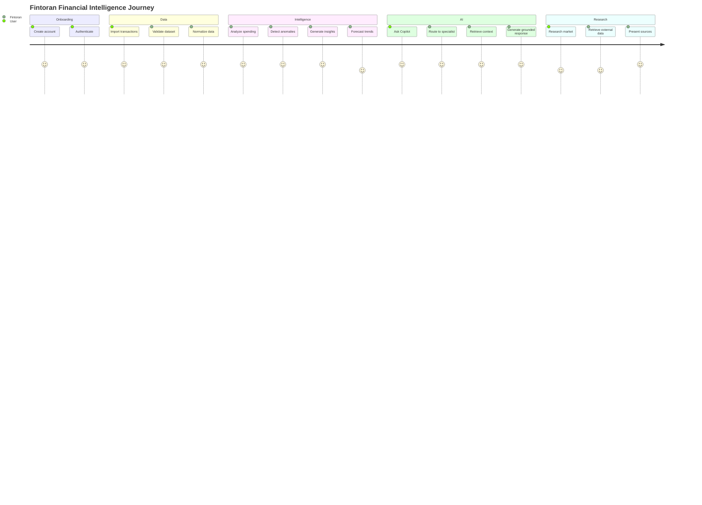

<br/>

## ✦ Conceptual Data Ownership

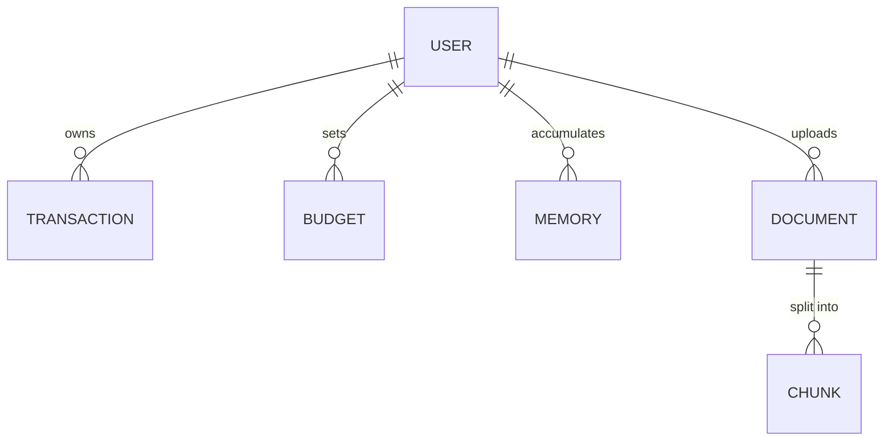

<br/>

## ✦ Tech Stack

<div align="center">

| Layer | Technologies |
|:---|:---|
| **Frontend** |  |
| **Application** |     |
| **AI** |  LLM reasoning · Agent orchestration · RAG |
| **Data** |    |
| **External Data** | SEC / XBRL · FRED · Market data providers |
| **Security** | bcrypt · Input validation · User isolation · Safe file handling |
| **DevOps** |   Streamlit Community Cloud |
| **Testing** |  |

</div>

<br/>

## ✦ Project Structure

```text
Fintoran/
│
├── app.py
│
├── agents/
│   ├── supervisor
│   ├── personal finance
│   ├── market research
│   ├── analytics
│   └── document / RAG
│
├── services/
│   ├── import pipeline
│   ├── analytics
│   ├── forecasting
│   ├── anomaly detection
│   ├── market data
│   └── persistence
│
├── tools/
│   ├── financial tools
│   ├── market tools
│   └── retrieval tools
│
├── tests/
│   ├── unit tests
│   ├── integration tests
│   └── security tests
│
├── data/
│   └── datasets
│
├── .streamlit/
│   └── config.toml
│
├── Dockerfile
├── requirements.txt
├── pytest.ini
├── .env.example
├── SECURITY.md
├── DATA_SOURCES.md
├── EVALUATION.md
├── TESTING.md
└── README.md
```

<br/>

## ✦ Quick Start

<details open>
<summary><b>1 · Clone and set up the environment</b></summary>

<br/>

```bash
git clone https://github.com/i-Anurag1/Fintoran.git
cd Fintoran

python -m venv .venv
```

Activate the environment:

```powershell
# Windows
.venv\Scripts\Activate.ps1
```

```bash
# Linux / macOS
source .venv/bin/activate
```

Install dependencies:

```bash
pip install -r requirements.txt
```

</details>

<details open>
<summary><b>2 · Configure secrets</b></summary>

<br/>

```bash
cp .env.example .env
```

```powershell
# Windows PowerShell
Copy-Item .env.example .env
```

Example `.env`:

```env
GROQ_API_KEY=your_groq_key
GROQ_MODEL=llama-3.3-70b-versatile
GROQ_FALLBACK_MODELS=llama-3.1-8b-instant
FRED_API_KEY=your_fred_key
SEC_USER_AGENT=Fintoran/1.0 your-email@example.com
```

> ⚠️ **Never commit `.env`.** On Streamlit Community Cloud, configure secrets through the app settings instead of committing secret files.

</details>

<details open>
<summary><b>3 · Run the app</b></summary>

<br/>

```bash
streamlit run app.py
```

</details>

<details>
<summary><b>4 · Run the tests</b></summary>

<br/>

```bash
pytest -q
python -m compileall .
```

</details>

<details>
<summary><b>5 · Run with Docker</b></summary>

<br/>

```bash
docker build -t fintoran .
docker run --env-file .env -p 8501:8501 fintoran
```

Then open `http://localhost:8501`.

</details>

<br/>

## ✦ Project Status

<div align="center">

| Component | Status |
|:---|:---:|
| Core Application |  |
| Agent Architecture |  |
| Financial Analytics |  |
| CSV Import Pipeline |  |
| Forecasting |  |
| Anomaly Detection |  |
| RAG |  |
| Persistent Memory |  |
| Market Research |  |
| Authentication |  |
| Security Hardening |  |
| Automated Tests |  |
| Docker |  |
| CI Validation |  |
| Streamlit Deployment |  |

</div>

<br/>

## ✦ Engineering Principles

<div align="center">

| # | Principle |
|:---:|:---|
| 1 | Deterministic financial computation |
| 2 | Explicit data provenance |
| 3 | User data isolation |
| 4 | Agent specialization |
| 5 | Retrieval-grounded answers |
| 6 | Validated external data |
| 7 | Safe file processing |
| 8 | Reproducible testing |
| 9 | Containerized deployment |
| 10 | Financial safety disclaimers |

</div>

<br/>

## ✦ Design Philosophy

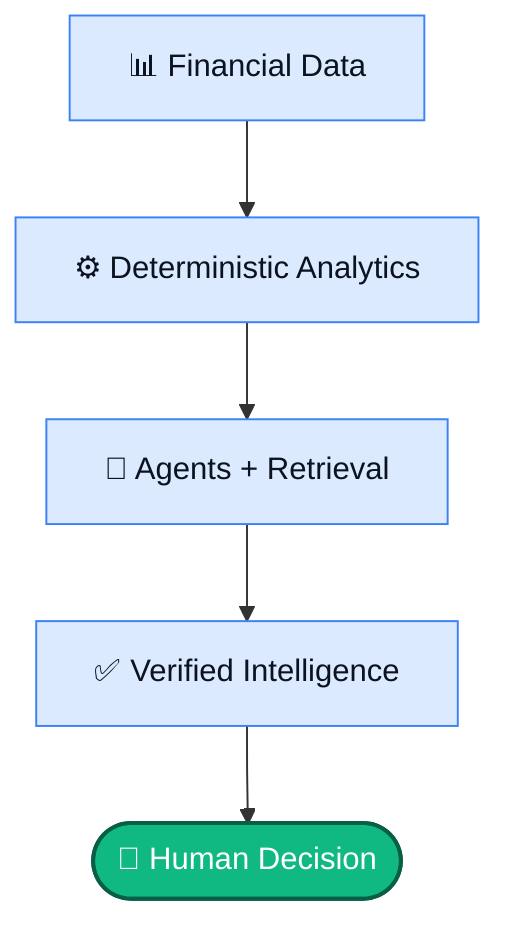

Fintoran does not attempt to replace financial judgment. It provides structured information, calculations, context and explanations so users can make informed decisions.

<br/>

## ✦ Roadmap

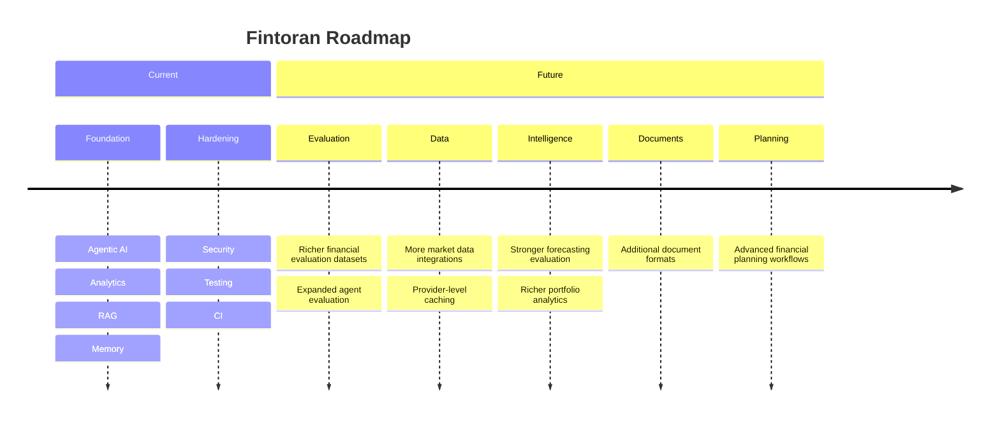

<br/>

## ✦ Financial Safety

> ⚠️ Fintoran is an **information and analysis tool**. Its outputs are not a substitute for professional financial, investment, tax or legal advice.
>
> Market and financial information changes over time. Please verify important information independently before making financial decisions.

<br/>

## ✦ Repository and Links

<div align="center">

[](https://github.com/i-Anurag1/Fintoran)
[](https://fintoranagent.streamlit.app/)

</div>

## ✦ License

See the repository for the applicable project license and terms.

<br/>

<div align="center">

```text
DATA  →  ANALYZE  →  RETRIEVE  →  REASON  →  VERIFY  →  UNDERSTAND
```

### Agentic AI for Personal Financial Intelligence

**Built with Python · Streamlit · LangGraph · LangChain · Groq · SQLite · Chroma · Docker · Pytest**

<br/>

[Live Demo](https://fintoranagent.streamlit.app/) &nbsp;·&nbsp; [Source Code](https://github.com/i-Anurag1/Fintoran)


</div>
