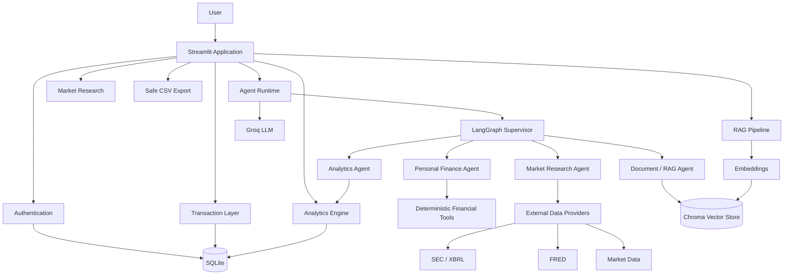
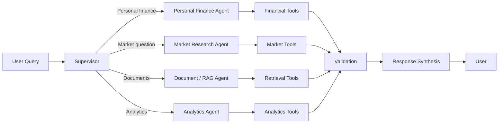
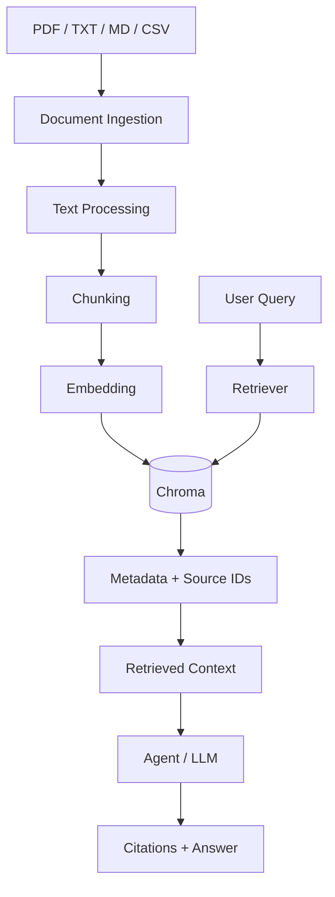
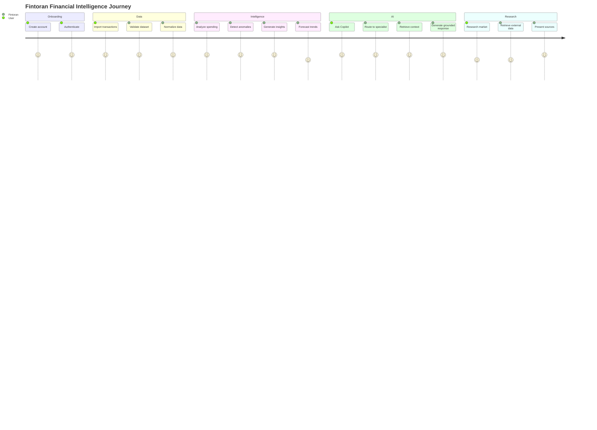
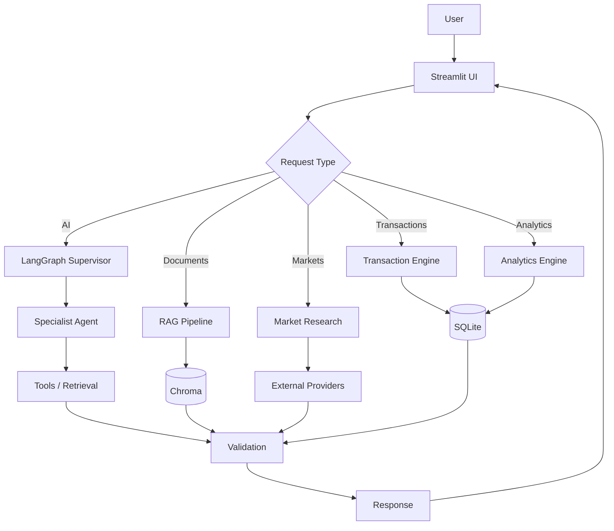
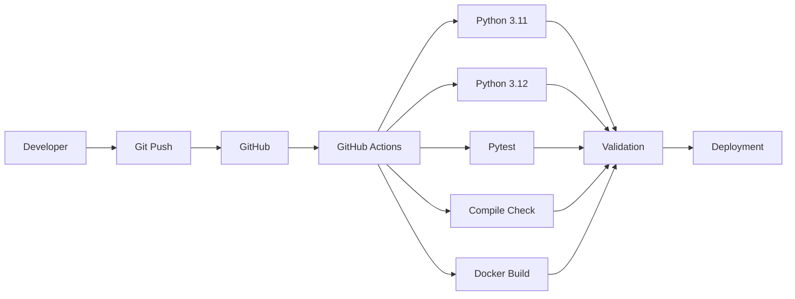

<div align="center">

# F I N T O R A N

### Agentic AI Personal Finance Intelligence Platform

**Turn raw financial data into structured intelligence, explanations, forecasts, anomaly signals, and actionable insights.**

[](https://www.python.org/)
[](https://streamlit.io/)
[](https://langchain-ai.github.io/langgraph/)
[](https://www.langchain.com/)
[](https://groq.com/)
[](https://www.sqlite.org/)
[](https://www.trychroma.com/)
[](https://www.docker.com/)
[](https://pytest.org/)

<br>

**[Live Demo](https://fintoranagent.streamlit.app/)**
&nbsp;&nbsp;|&nbsp;&nbsp;
**[GitHub Repository](https://github.com/i-Anurag1/Fintoran)**

<br>


</div>

---

# FINTORAN

```text
███████╗██╗███╗   ██╗████████╗ ██████╗ ██████╗  █████╗ ███╗   ██╗
██╔════╝██║████╗  ██║╚══██╔══╝██╔═══██╗██╔══██╗██╔══██╗████╗  ██║
█████╗  ██║██╔██╗ ██║   ██║   ██║   ██║██████╔╝███████║██╔██╗ ██║
██╔══╝  ██║██║╚██╗██║   ██║   ██║   ██║██╔══██╗██╔══██║██║╚██╗██║
██║     ██║██║ ╚████║   ██║   ╚██████╔╝██║  ██║██║  ██║██║ ╚████║
╚═╝     ╚═╝╚═╝  ╚═══╝   ╚═╝    ╚═════╝ ╚═╝  ╚═╝╚═╝  ╚═╝╚═╝  ╚═══╝
```

> Fintoran is an agentic AI financial intelligence workspace designed to transform personal financial data into structured, explainable and actionable insights.

The platform combines:

* deterministic financial analytics
* agentic AI orchestration
* persistent conversational memory
* document-grounded RAG
* transaction intelligence
* budgeting
* forecasting
* anomaly detection
* market research
* secure account isolation
* reproducible testing
* containerized deployment

The central design principle is simple:

```text
                    FINTORAN
                       |
          +------------+------------+
          |                         |
   DETERMINISTIC               AGENTIC AI
   COMPUTATION                 REASONING
          |                         |
          v                         v
  Exact numbers             Explanations
  Aggregations              Planning
  Forecasts                 Synthesis
  Anomalies                 Retrieval
  Metrics                   Financial dialogue
          |                         |
          +------------+------------+
                       |
                       v
              FINANCIAL INTELLIGENCE
```

---

# PRODUCT VISION

Fintoran is not designed as a generic chatbot placed on top of a spreadsheet.

It is designed as a financial intelligence layer.

```text
┌────────────────────────────────────────────────────────────────────┐
│                         FINTORAN WORKSPACE                         │
├────────────────────────────────────────────────────────────────────┤
│                                                                    │
│  TRANSACTIONS       ANALYTICS        BUDGETS       INSIGHTS       │
│       │                 │               │              │            │
│       └─────────────────┴───────────────┴──────────────┘            │
│                              │                                     │
│                              ▼                                     │
│                    FINANCIAL INTELLIGENCE                          │
│                              │                                     │
│              ┌───────────────┼───────────────┐                     │
│              ▼               ▼               ▼                     │
│          AI COPILOT       RAG/DOCS       MARKET RESEARCH           │
│              │               │               │                     │
│              └───────────────┼───────────────┘                     │
│                              ▼                                     │
│                       ACTIONABLE OUTPUT                            │
│                                                                    │
└────────────────────────────────────────────────────────────────────┘
```

---

# CORE CAPABILITIES

| Module          | Capability                                                     |
| --------------- | -------------------------------------------------------------- |
| Overview        | Financial health summary and key metrics                       |
| AI Copilot      | Agentic financial conversations                                |
| Transactions    | Search, filtering, categorization and transaction intelligence |
| Analytics       | Spending, income, category and trend analysis                  |
| Budgets         | Budget tracking and financial planning                         |
| Insights        | Automated financial observations                               |
| Market Research | Market, macroeconomic and company research                     |
| Documents / RAG | Grounded answers from uploaded financial documents             |
| Memory          | Persistent conversation context                                |
| Settings        | Account and application configuration                          |

---

# SYSTEM ARCHITECTURE



---

# DATA FLOW

```text
                         RAW INPUT
                            |
             +--------------+--------------+
             |              |              |
           CSV            PDF/TXT/MD     Conversation
             |              |              |
             v              v              v
       IMPORT PIPELINE   DOCUMENT RAG   MEMORY
             |              |              |
             v              v              v
         VALIDATE        CHUNK         CONTEXT
             |              |              |
             v              v              |
         NORMALIZE      EMBED             |
             |              |              |
             v              v              |
         ENRICH         CHROMA            |
             |              |              |
             +--------------+--------------+
                            |
                            v
                    AGENT ORCHESTRATION
                            |
                +-----------+-----------+
                |           |           |
                v           v           v
             ANALYZE     RETRIEVE    REASON
                |           |           |
                +-----------+-----------+
                            |
                            v
                      VERIFY OUTPUT
                            |
                            v
                    USER-FACING INSIGHT
```

---

# AGENTIC ARCHITECTURE

Fintoran uses a supervisor-driven architecture instead of routing every request directly to a single LLM.



### Why a supervisor?

```text
USER
 |
 v
SUPERVISOR
 |
 +----> Personal Finance
 |
 +----> Market Research
 |
 +----> Documents / RAG
 |
 +----> Analytics
 |
 v
VALIDATED RESULT
 |
 v
SYNTHESIZED RESPONSE
```

This separates:

```text
COMPUTATION  !=  REASONING  !=  RETRIEVAL  !=  PRESENTATION
```

Financial arithmetic stays deterministic.

The LLM is used where language reasoning and synthesis provide value.

---

# FINANCIAL DATA PIPELINE

Fintoran treats imported financial data as a pipeline rather than directly inserting raw CSV rows into the database.

```text
RAW
 |
 v
┌───────────────┐
│ Schema Detect │
└───────┬───────┘
        v
┌───────────────┐
│ Column Mapping│
└───────┬───────┘
        v
┌───────────────┐
│ Validation    │
└───────┬───────┘
        v
┌───────────────┐
│ Normalization │
└───────┬───────┘
        v
┌───────────────┐
│ Enrichment    │
└───────┬───────┘
        v
┌───────────────┐
│ Duplicate     │
│ Detection     │
└───────┬───────┘
        v
┌───────────────┐
│ Persistence   │
└───────┬───────┘
        v
      SQLite
```

Supported pipeline concerns include:

* schema detection
* column mapping
* dates
* debit / credit handling
* currency normalization
* malformed rows
* duplicate detection
* transaction categorization
* merchant information
* recurring transactions
* preview before import
* import summaries
* provenance
* safe export

---

# ANALYTICS ENGINE

The analytics layer is intentionally deterministic.

```text
Transactions
     |
     +----> Income
     |
     +----> Expenses
     |
     +----> Categories
     |
     +----> Merchants
     |
     +----> Recurring Payments
     |
     +----> Time Series
     |
     v
Financial Metrics
     |
     +----> Cash Flow
     +----> Spending Trends
     +----> Category Distribution
     +----> Budget Utilization
     +----> Savings Patterns
     +----> Forecasts
     +----> Anomalies
```

The LLM does not perform core financial arithmetic.

```text
DATABASE
   |
   v
DETERMINISTIC COMPUTATION
   |
   v
VERIFIED NUMBERS
   |
   v
LLM EXPLANATION
```

---

# FORECASTING

Fintoran supports financial forecasting through deterministic methods where sufficient data exists.

```text
Historical Transactions
          |
          v
      Time Series
          |
          v
     Model Selection
          |
    +-----+-----+
    |     |     |
    v     v     v
  Naive Moving Weighted
        Average Average
    |     |     |
    +-----+-----+
          |
          v
     Holdout Check
          |
          v
    Forecast + Range
```

Forecasts are presented with uncertainty only when the available data supports it.

---

# ANOMALY DETECTION

Fintoran analyzes multiple dimensions instead of treating every unusual amount as an anomaly.

```text
                    TRANSACTION
                         |
        +----------------+----------------+
        |                |                |
      Amount          Merchant         Category
        |                |                |
        +----------------+----------------+
                         |
                 Frequency Pattern
                         |
                 Recurring Pattern
                         |
                    Date / Time
                         |
                         v
                 Anomaly Analysis
                         |
                         v
                   Explanation
```

Potential signals include:

* unusual amount
* unusual merchant
* unusual category
* unusual frequency
* recurring-payment deviation
* unusual day
* unusual time
* historical behavior deviation

---

# RAG ARCHITECTURE

Conversation memory and document retrieval are separate systems.



Document retrieval supports:

* document ingestion
* chunking
* embeddings
* Chroma storage
* metadata
* source identifiers
* retrieval scores
* document isolation
* reindexing
* duplicate handling
* deletion
* source-aware responses

---

# MEMORY VS RAG

```text
                    FINTORAN
                       |
             +---------+---------+
             |                   |
             v                   v
       CONVERSATION          DOCUMENT RAG
          MEMORY                MEMORY
             |                   |
       User dialogue        User documents
             |                   |
       Context recall       Grounded retrieval
             |                   |
             v                   v
        Chroma /             Chroma /
        memory layer         document layer
```

They solve different problems.

```text
MEMORY
"What did we discuss?"

RAG
"What does my uploaded document say?"
```

---

# MARKET RESEARCH

The market research layer is designed around external data provenance.

```text
                    MARKET QUESTION
                           |
                           v
                 MARKET RESEARCH AGENT
                           |
        +------------------+------------------+
        |                  |                  |
        v                  v                  v
      Price             Company             Macro
        |               Data                 Data
        |                  |                  |
        v                  v                  v
 Market Provider       SEC/XBRL             FRED
        |                  |                  |
        +------------------+------------------+
                           |
                           v
                    SOURCE VALIDATION
                           |
                           v
                    DATA SYNTHESIS
                           |
                           v
                     SOURCE PANEL
```

Research capabilities include:

* quotes
* historical prices
* returns
* volatility
* drawdowns
* moving averages
* volume
* company fundamentals
* SEC filings
* earnings information
* macroeconomic indicators
* source provenance

---

# SECURITY MODEL

Fintoran treats financial data as private application data.

```text
                    AUTHENTICATED USER
                           |
                           v
                    USER ISOLATION
                           |
              +------------+------------+
              |            |            |
              v            v            v
         Transactions    Memory      Documents
              |            |            |
              +------------+------------+
                           |
                           v
                     APPLICATION
```

Security considerations include:

* bcrypt authentication
* account-level data isolation
* input validation
* upload validation
* path traversal protection
* upload limits
* safe CSV export
* formula injection protection
* environment-based secrets
* no API keys committed to source
* private document isolation
* prompt injection defenses
* safe rendering
* controlled logging

---

# SAFE CSV EXPORT

Spreadsheet formula injection is explicitly handled during export.

```text
=SUM(A1:A2)
+100
-100
@command
```

becomes safely neutralized before export.

```text
'=SUM(A1:A2)
'+100
'-100
'@command
```

This prevents exported values beginning with spreadsheet formula prefixes from being interpreted as formulas by spreadsheet applications.

---

# APPLICATION STRUCTURE

```text
Fintoran/
│
├── app.py
│
├── agents/
│   ├── supervisor
│   ├── personal finance
│   ├── market research
│   ├── analytics
│   └── document / RAG
│
├── services/
│   ├── import pipeline
│   ├── analytics
│   ├── forecasting
│   ├── anomaly detection
│   ├── market data
│   └── persistence
│
├── tools/
│   ├── financial tools
│   ├── market tools
│   └── retrieval tools
│
├── tests/
│   ├── unit tests
│   ├── integration tests
│   └── security tests
│
├── data/
│   └── datasets
│
├── .streamlit/
│   └── config.toml
│
├── Dockerfile
├── requirements.txt
├── pytest.ini
├── .env.example
├── SECURITY.md
├── DATA_SOURCES.md
├── EVALUATION.md
├── TESTING.md
└── README.md
```

---

# USER JOURNEY



---

# TECHNICAL STACK

```text
FRONTEND
└── Streamlit

APPLICATION
├── Python
├── LangChain
├── LangGraph
└── Pydantic / typed application models

AI
├── Groq
├── LLM-based reasoning
├── Agent orchestration
└── Retrieval-augmented generation

DATA
├── SQLite
├── Chroma
├── Pandas
└── Financial datasets

EXTERNAL DATA
├── SEC / XBRL
├── FRED
└── Market data providers

SECURITY
├── bcrypt
├── Input validation
├── User isolation
└── Safe file handling

DEVOPS
├── Docker
├── GitHub Actions
└── Streamlit Community Cloud

TESTING
└── Pytest
```

---

# PROJECT FLOW



---

# ENGINEERING PRINCIPLES

```text
1. DETERMINISTIC FINANCIAL COMPUTATION
2. EXPLICIT DATA PROVENANCE
3. USER DATA ISOLATION
4. AGENT SPECIALIZATION
5. RETRIEVAL-GROUNDED ANSWERS
6. VALIDATED EXTERNAL DATA
7. SAFE FILE PROCESSING
8. REPRODUCIBLE TESTING
9. CONTAINERIZED DEPLOYMENT
10. FINANCIAL SAFETY DISCLAIMERS
```

---

# RELIABILITY

Fintoran is designed around failure-aware agent execution.

```text
LLM REQUEST
    |
    v
TIMEOUT
    |
    +----> SUCCESS
    |
    +----> RETRY / BACKOFF
              |
              +----> SUCCESS
              |
              +----> FALLBACK MODEL
                          |
                          +----> SUCCESS
                          |
                          +----> SAFE ERROR
```

The architecture separates provider failure from core deterministic financial functionality.

---

# TESTING

The repository includes automated validation for the application.

```text
                TEST SUITE
                    |
        +-----------+-----------+
        |           |           |
        v           v           v
      UNIT     INTEGRATION   SECURITY
        |           |           |
        +-----------+-----------+
                    |
                    v
               PYTEST
                    |
                    v
             CI VERIFICATION
```

Validation covers application behavior, financial processing, import behavior, security-sensitive paths and regression cases.

Current project validation includes:

```text
49 PASSED
```

along with compile validation and application smoke testing.

GitHub Actions also validates the project across supported Python environments and Docker build validation.

---

# CI / CD



---

# DOCKER

The application is containerized for reproducible deployment.

```text
Dockerfile
    |
    v
Build
    |
    v
Install Dependencies
    |
    v
Non-Root Runtime
    |
    v
Healthcheck
    |
    v
Streamlit Application
```

The container configuration is designed around:

* deterministic startup
* non-root execution
* health checks
* application isolation
* runtime environment variables
* reproducible dependency installation

---

# CONFIGURATION

Create a local environment file from the provided example:

```bash
cp .env.example .env
```

Windows PowerShell:

```powershell
Copy-Item .env.example .env
```

Example configuration:

```env
GROQ_API_KEY=your_groq_key
GROQ_MODEL=llama-3.3-70b-versatile
GROQ_FALLBACK_MODELS=llama-3.1-8b-instant
FRED_API_KEY=your_fred_key
SEC_USER_AGENT=Fintoran/1.0 your-email@example.com
```

Never commit `.env`.

For Streamlit Community Cloud, configure secrets through the application settings rather than committing secret files to Git.

---

# LOCAL DEVELOPMENT

```bash
git clone https://github.com/i-Anurag1/Fintoran.git
cd Fintoran

python -m venv .venv
```

Activate the environment.

Windows:

```powershell
.venv\Scripts\Activate.ps1
```

Linux / macOS:

```bash
source .venv/bin/activate
```

Install dependencies:

```bash
pip install -r requirements.txt
```

Create configuration:

```bash
cp .env.example .env
```

Run:

```bash
streamlit run app.py
```

---

# TESTING LOCALLY

```bash
pytest -q
```

Compile validation:

```bash
python -m compileall .
```

---

# DOCKER DEVELOPMENT

Build:

```bash
docker build -t fintoran .
```

Run:

```bash
docker run --env-file .env -p 8501:8501 fintoran
```

Open:

```text
http://localhost:8501
```

---

# REPOSITORY

```text
GitHub
└── i-Anurag1/Fintoran
    |
    ├── Streamlit application
    ├── Agentic AI architecture
    ├── Financial analytics
    ├── RAG
    ├── Persistent memory
    ├── Market research
    ├── Security
    ├── Tests
    ├── Docker
    └── CI
```

Repository:

[https://github.com/i-Anurag1/Fintoran](https://github.com/i-Anurag1/Fintoran)

Live application:

[https://fintoranagent.streamlit.app/](https://fintoranagent.streamlit.app/)

---

# PROJECT STATUS

```text
┌──────────────────────────────────────────────────────┐
│                    FINTORAN STATUS                   │
├──────────────────────────────────────────────────────┤
│                                                      │
│  Core Application              COMPLETE              │
│  Agent Architecture            COMPLETE              │
│  Financial Analytics           COMPLETE              │
│  CSV Import Pipeline            COMPLETE              │
│  Forecasting                    COMPLETE              │
│  Anomaly Detection              COMPLETE              │
│  RAG                            COMPLETE              │
│  Persistent Memory              COMPLETE              │
│  Market Research                COMPLETE              │
│  Authentication                 COMPLETE              │
│  Security Hardening             COMPLETE              │
│  Automated Tests                PASSING               │
│  Docker                         COMPLETE              │
│  CI Validation                  PASSING               │
│  Streamlit Deployment           LIVE                  │
│                                                      │
└──────────────────────────────────────────────────────┘
```

---

# DESIGN PHILOSOPHY

```text
              ┌─────────────────────┐
              │      FINANCIAL      │
              │        DATA         │
              └──────────┬──────────┘
                         │
                         ▼
              ┌─────────────────────┐
              │    DETERMINISTIC    │
              │      ANALYTICS      │
              └──────────┬──────────┘
                         │
                         ▼
              ┌─────────────────────┐
              │       AGENTS        │
              │   + RETRIEVAL       │
              └──────────┬──────────┘
                         │
                         ▼
              ┌─────────────────────┐
              │      VERIFIED       │
              │    INTELLIGENCE     │
              └──────────┬──────────┘
                         │
                         ▼
              ┌─────────────────────┐
              │       HUMAN         │
              │      DECISION       │
              └─────────────────────┘
```

Fintoran does not attempt to replace financial judgment.

It provides structured information, calculations, context and explanations so users can make informed financial decisions.

---

# ROADMAP

```text
                 FINTORAN
                    |
        +-----------+-----------+
        |                       |
     CURRENT                 FUTURE
        |                       |
        v                       v
 Agentic AI              Advanced Evaluation
 Analytics               More Data Providers
 RAG                     Better Forecasting
 Memory                  Deeper Market Research
 Security                Expanded Document Intelligence
 Testing                 Personalization
```

Potential future work includes:

* richer financial evaluation datasets
* expanded market data integrations
* stronger forecasting evaluation
* additional document formats
* richer portfolio analytics
* expanded agent evaluation
* provider-level caching improvements
* advanced financial planning workflows

---

# FINANCIAL SAFETY

Fintoran is an information and analysis tool.

Its outputs are not a substitute for professional financial, investment, tax or legal advice.

Market and financial information may change over time. Users should independently verify important information before making financial decisions.

---

# LICENSE

See the repository for the applicable project license and terms.

---

<div align="center">

## FINTORAN

```text
DATA
  ↓
ANALYZE
  ↓
RETRIEVE
  ↓
REASON
  ↓
VERIFY
  ↓
UNDERSTAND
```

### Agentic AI for Personal Financial Intelligence

**Built with Python, Streamlit, LangGraph, LangChain, Groq, SQLite, Chroma, Docker and Pytest.**

<br>

[Live Demo](https://fintoranagent.streamlit.app/)
  ·  
[Source Code](https://github.com/i-Anurag1/Fintoran)

</div>
